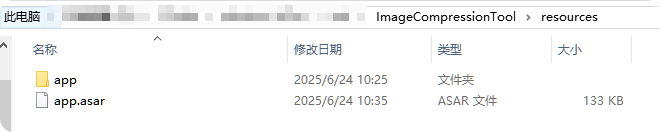

# 笔记

<BlogHead date="2025-12-30" tags="笔记📒"/>
✍️好记性不如烂笔头

---

### JS/TS相关

#### 数组对象去重

根据某个字段去重

1.遇到重复保留最后一次出现的数据

```js
const dedupeByKey = <T extends Record<string, any>, K extends keyof T>(array: T[], key: K): T[] => {
    const map = new Map<T[K], T>()
    array.foreach(item => map.set(item[key], item))
    return [...map.values()]
}
```

2.遇到重复保留第一次出现的数据

```js
const  dedupeByKey = <T extends Record<string, any>, K extends keyof T>(array: T[], key: K): T[] => {
    const set = new Set<T[K]>()
    return arrary.filter(item => {
        if (set.has(item[key])) return false
        set.add(item[key])
        return true
    })
}
```

#### 取默认值

下面是两种常见的取默认值写法：

```js
/** example1 */
const result = object.value || "default"

/** example2 */
const result = object.value ?? "default"
```

**区别**

- `||` 是逻辑或运算符，当左侧表达式是**假值**(false value)的时候，返回右侧的结果，否则返回左侧的结果
- `??` 是空值合并运算符，当左侧表达式为 `null` 或 `undefined` 时，返回右侧的结果，否则返回左侧的结果

> 假值(false value)
>
> - false
> - 0
> - "" (空字符串)
> - null
> - undefined
> - NaN

总体来说 `||` 范围更广包含了 `??` 在内，`??` 只有在 `null` 或 `undefined` 时才会触发。

<br />

#### 下载图片，触发浏览器保存

> 适用场景：后端返回文件地址，想实现点击下载，触发浏览器保存

方法一（代码简单，但如果服务器设置图片不能下载，则无法触发浏览器保存）：

```js
const downloadFile = (url: string) => {
  const link = document.createElement("a")
  link.href = url
  link.download = "文件名"
  document.body.appendChild(link)
  link.click()
  document.body.removeChild(link)
}
```

方法二（比较万能，但是会有跨域问题，原理是使用canvas）：

```js
const downloadFile = (url: string, name: string) => {
  let image = new Image()
  image.setAttribute("crossOrigin", "anonymous")
  image.src = url
  image.onload = () => {
    let canvas = document.createElement("canvas")
    canvas.width = image.width
    canvas.height = image.height
    let ctx = canvas.getContext("2d")
    if (ctx) {
      ctx.drawImage(image, 0, 0, image.width, image.height)
      canvas.toBlob((blob) => {
        if (blob) {
          let url = URL.createObjectURL(blob)
          let eleLink = document.createElement("a")
      eleLink.download = name
          eleLink.href = href
          eleLink.click()
          eleLink.remove()
          // 用完释放URL对象
          URL.revokeObjectURL(url)
        }
      })
    }
  }
}
```

<br />

#### 下载文件，触发浏览器保存（终极方案）

> 适用场景：后端返回文件地址，想实现点击下载，触发浏览器保存。无论是图片、文件都可以，可以接受流也可以接受文件URL

```js
/**
 * 通用文件下载方法，支持图片、Excel、PDF等文件类型
 * @param {string|Blob} source - 文件URL或Blob对象
 * @param {string} filename - 下载的文件名（带扩展名）
 */
export const downloadFile = async (source: string | Blob, filename: string) => {
  if (!source) return

  try {
    // 处理Blob对象
    if (source instanceof Blob) {
      const url = URL.createObjectURL(source)
      const link = document.createElement("a")
      link.href = url
      link.download = filename
      document.body.appendChild(link)
      link.click()

      // 清理资源
      setTimeout(() => {
        document.body.removeChild(link)
        URL.revokeObjectURL(url)
      }, 100)
      return
    }

    // 处理URL
    // 对于跨域文件，使用 fetch 获取文件内容
    const response = await fetch(source)
    const blob = await response.blob()

    // 创建临时 URL
    const blobUrl = window.URL.createObjectURL(blob)

    const link = document.createElement("a")
    link.href = blobUrl
    link.download = filename // 添加扩展名
    document.body.appendChild(link)
    link.click()
    document.body.removeChild(link)

    // 清理临时 URL
    window.URL.revokeObjectURL(blobUrl)
  } catch (error) {
    // 如果 fetch 失败，回退到直接打开
    window.open(source as string)
  }
}
```

<br />

### **Vue相关**

#### 文件流转图片显示

> 适用场景：后端返回图片流，前端直接显示（可以用img标签）。适用于二维码显示、预览图片显示等

```js
const captchaImage = ref("")
const getImage = async () => {
  // 请求接口获取图片流
  const res = await getCodeImageApi()
  // 获取图片
  const blob = new Blob([res.data], { type: "image/jpeg" })
  captchaImage.value = URL.createObjectURL(blob)
}
```

<br />

### CSS相关

#### Flexbox 陷阱

##### 陷阱1：居中布局 + 内容溢出 = 顶部内容丢失

**场景描述：**

使用 Flexbox 进行垂直居中布局时，如果子元素总高度超出父容器，**顶部内容会被截断且无法滚动到**。

举个例子：父容器高度 500px，内部有 9 个子元素（每个 100px），设置了 `flex-direction: column` + `justify-content: center`。当子元素超过 5 个时，上方的元素就会溢出到容器顶部之外，被"吃掉"。

**❓ `overflow: auto` 能解决吗？**

**不能。** 设置 `overflow: auto` 后虽然会出现滚动条，但滚动条只能**往下滚**，溢出到顶部之外的内容（如 item 1、2、3）**永远无法滚动到**。

**❓ 核心问题**

> 内容高度不确定，可能溢出，同时又需要垂直居中——怎么办？

**原因分析：**

`align-items: center` / `justify-content: center` 会将内容**向中心挤压**。当内容总高度超出容器时，溢出部分被均匀分配到两端，而顶部溢出的区域处于滚动起点之前，滚动条无法到达。

```
┌──────────────┐
│  Invisible   │ ← 内容溢出到容器顶部之外，滚动条无法到达
│   item 1     │
│   item 2     │
├──────────────┤ ← 容器顶部
│   item 3     │
│   item 4     │ ← 居中点
│   item 5     │
├──────────────┤ ← 容器底部
│   item 6     │
│  Invisible   │ ← 这部分可以滚动到
└──────────────┘
```

**✅ 解决方案：用 `margin: auto` 替代居中属性**

`margin: auto` 在 Flex 容器中同样可以实现居中效果，但当内容溢出时，它不会把内容推到滚动起点之前，所有内容都能通过滚动访问到。

```css
.container {
  display: flex;
  flex-direction: column;
  overflow: auto;
}

.item {
  margin: auto 0; /* 垂直方向 auto 实现居中，水平方向保持不变 */
}
```

::: warning 结论
可滚动容器内，**永远不要用 `align-items: center` / `justify-content: center`**，请用 **`margin: auto`** 替代。
:::

<br />

#### pointer-events

`pointer-events` 属性用于控制元素是否能成为鼠标事件(比如鼠标点击、悬停（hover）、拖拽等事件)的目标。常用的可以设置以下值：

`auto`：默认值，元素可以成为鼠标事件的目标。

- 元素表现出正常的行为。
- 它会响应鼠标点击、悬停（hover）、拖拽等事件。
- 它会遮挡位于其下方的元素，下方的元素无法接收事件。

`none`：元素不会成为鼠标事件的目标，鼠标事件会穿透到下面的元素。

- 元素变为“虚无”
- 点击穿透：元素永远不会成为鼠标事件的目标。点击该元素时，浏览器会忽略它，事件会直接穿透到该元素下方的元素（在 Z 轴上下一个元素）。
- 交互失效：在该元素上绑定的 JavaScript click、mouseenter 等监听器不会触发。
- CSS 状态失效：该元素上的 CSS :hover、:active 伪类样式将不会生效。
- 光标：鼠标指针经过时不会感知到该元素（例如不会变成小手图标，文本光标也不会显示）。

⚠️**继承与恢复（关键点）**

- 继承性：`pointer-events` 属性是可以继承的。如果一个父元素设置了 `pointer-events: none;`，那么它的所有子元素也会继承这个属性，导致子元素同样无法响应鼠标事件。
- 可恢复性：如果你想让某个子元素恢复鼠标事件响应能力，可以在该子元素上单独设置 `pointer-events: auto;`。

**常见场景**

1. 禁用交互：当你想让某个元素（如按钮、链接等）暂时不可点击时，可以使用 `pointer-events: none;`。
2. 创建覆盖层：在创建模态对话框或加载遮罩时，可以使用 `pointer-events: none;` 来确保遮罩层不会阻止用户与下方内容的交互。
3. 自定义拖拽行为：在实现拖拽功能时，可以使用 `pointer-events` 来控制哪些元素可以响应拖拽事件。
4. 水印效果：在图片或内容上添加水印时，可以使用 `pointer-events: none;` 让水印不影响用户对内容的操作。

<br />

#### 通用两栏文字排版做法【grid终极方案】

```html
<style>
  .box {
    display: grid;
    grid-template-columns: max-content 1fr; // 两列，第一列宽度自适应内容，第二列占满剩余空间
    row-gap: 16px;
    column-gap: 24px;
    align-items: center;
  }
</style>

<div class="box">
  <div>手机号</div>
  <div>13888888888</div>

  <div>地址</div>
  <div>广东省深圳市某某区某某街道</div>

  <div>商品支付超时等待订单</div>
  <div>这是一条很长的label</div>

  <div>L</div>
  <div>这是一条很短的label</div>
</div>
```

<br />

#### 图片闪烁/呼吸灯效果

```css
img {
  animation: blink 3s infinite; /* 设置图片动画 */
}

@keyframes blink {
  0% {
    opacity: 1; /* 动画开始时不透明 */
  }
  50% {
    opacity: 0; /* 动画中间时完全透明 */
  }
  100% {
    opacity: 1; /* 动画结束时重新不透明 */
  }
}
```

<br />

#### `color-mix()` 函数

**代码举例：**

```css
background: color-mix(in srgb, var(--el-menu-active-color) 10%, transparent);
```

**参数说明：**

- `in srgb`: 指定颜色空间为 sRGB（标准红绿蓝色彩空间）
- `var(--el-menu-active-color) 10%`: 使用 CSS 自定义属性（CSS 变量）作为第一个颜色，占混合比例的 10%
- `transparent`: 第二个颜色是透明色，占剩余的 90%

**效果：** 这会创建一个半透明版本的背景颜色，透明度为 90%

**其他用法举例：**

```css
// 混合红色和蓝色，各占50%
background: color-mix(in srgb, red, blue);

// 红色占70%，蓝色占30%
background: color-mix(in srgb, red 70%, blue);

// 将主题色与白色混合，创建较浅的版本
background: color-mix(in srgb, var(--primary-color) 20%, white);

// 创建悬停效果
.button {
  background: var(--button-color);

  &:hover {
    background: color-mix(in srgb, var(--button-color) 80%, white);
  }
}
```

**不同颜色空间**

```css
// 使用不同的颜色空间进行混合
color-mix(in hsl, red, blue) // HSL 色彩空间
color-mix(in hwb, red, blue) // HWB 色彩空间
color-mix(in lab, red, blue) // LAB 色彩空间
```

**总结：**

`color-mix`能做到与`rgba`一样的效果，但两者之间有细微区别：`rgba`更加通用简单，但是不适合带有变量的参数，而`color-mix`能做到使用变量来实现透明度。

::: tip
⚠️ `color-mix()` 是相对较新的 CSS 功能，需要检查目标浏览器支持情况
:::

<br />

### electron

#### 加密打包后的程序源码

1.安装**`asar`**

```bash
# pnpm下载
pnpm i asar -g

# npm下载
npm install asar -g
```

2.在resources目录下使用asar指令进行加密

```bash
asar pack ./app app.asar
```

加密后结果如下：



3.删除app文件后重新打开程序，没问题代表加密成功
