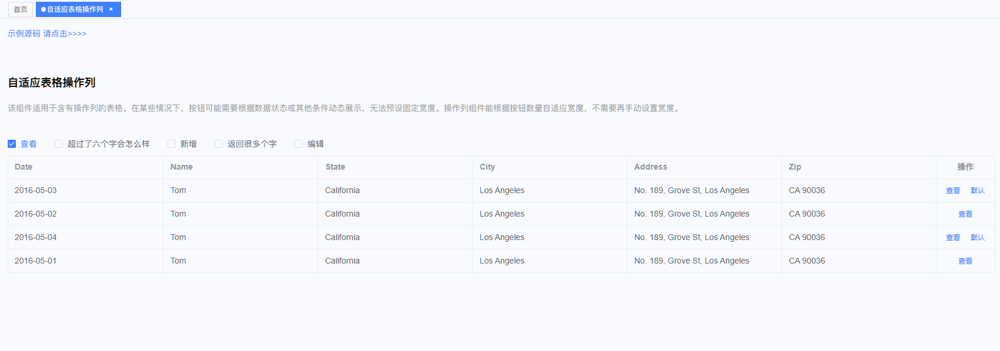
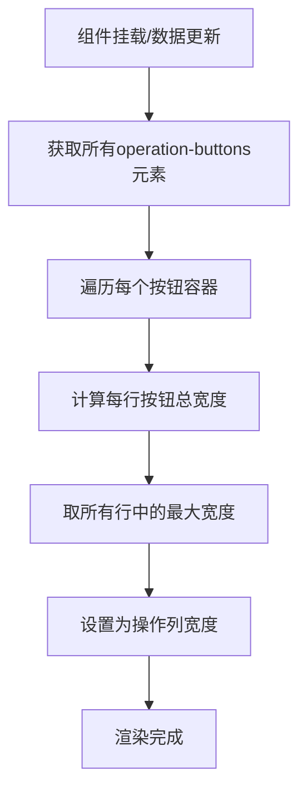

# 基于Vue3 + Element Plus项目实现el-table表格操作列自适应宽度组件

## 前言

在实际的后台管理系统开发中，表格是最常用的数据展示组件之一。而表格的操作列（通常包含编辑、删除、查看等按钮）往往需要根据业务需求动态显示不同的按钮，这就带来了一个问题：**如何让操作列的宽度能够自适应按钮的数量和内容长度？**

传统的解决方案是手动设置固定宽度，但这种方式存在以下问题：
- 宽度设置过小，按钮可能会被挤压或换行
- 宽度设置过大，会浪费表格空间
- 按钮数量动态变化时，固定宽度无法适应

本文将介绍如何基于 Vue3 + Element Plus 实现一个智能的表格操作列自适应宽度组件。该组件适用于含有操作列的表格。在某些情况下，按钮可能需要根据数据状态或其他条件动态展示，无法预设固定宽度。操作列组件能根据按钮数量自适应宽度，不需要再手动设置宽度。

## 效果

废话不多说，先看效果：



## 组件设计思路

### 核心原理

自适应宽度的核心思路是：**动态计算操作列中所有按钮的实际宽度，然后将计算结果作为列宽度**。



### 实现步骤

1. **创建自定义指令**：监听DOM元素的挂载和更新
2. **宽度计算算法**：遍历所有按钮，计算实际占用宽度
3. **响应式更新**：数据变化时重新计算宽度
4. **兼容性处理**：支持最小宽度设置，避免过窄

## 组件实现详解

### 1. 组件基础结构

```vue
<template>
  <el-table-column
    :label="label"
    :fixed="fixed"
    :align="align"
    :show-overflow-tooltip="showOverflowTooltip"
    :width="finalWidth"
  >
    <template #default="{ row }">
      <div v-auto-width class="operation-buttons">
        <slot :row="row"></slot>
      </div>
    </template>
  </el-table-column>
</template>
```

**关键点说明：**
- `v-auto-width`：自定义指令，用于触发宽度计算
- `class="operation-buttons"`：标识容器，便于选择器定位
- `<slot>`：插槽，允许外部传入按钮内容
- `:width="finalWidth"`：动态宽度绑定

### 2. Props 接口设计

```typescript
interface Props {
  listDataLength: number;      // 数据长度，用于判断计算时机
  prop?: string;
  label?: string;              // 列标题，默认"操作"
  fixed?: string;              // 固定位置，默认"right"
  align?: string;              // 对齐方式，默认"center"
  width?: number;              // 手动指定宽度（优先级最高）
  showOverflowTooltip?: boolean;
  minWidth?: number;           // 最小宽度，默认80px
}
```

### 3. 核心算法实现

#### 宽度计算逻辑

```typescript
const calculateWidth = () => {
  count.value++;
  
  // 等待所有行渲染完成后再计算
  if (count.value !== props.listDataLength) return;
  
  const maxWidth = getOperationMaxWidth();
  operationWidth.value = Math.max(maxWidth, props.minWidth);
  count.value = 0;
};
```

#### 获取最大宽度算法

```typescript
const getOperationMaxWidth = () => {
  const el = document.getElementsByClassName("operation-buttons");
  
  let maxWidth = 0;
  let totalWidth: any = 0;
  
  Array.prototype.forEach.call(el, (item) => {
    // 获取每个容器内的所有按钮
    const buttons = item.querySelectorAll(".el-button");
    
    // 计算每行按钮的总宽度
    totalWidth = Array.from(buttons).reduce((acc, button: any) => {
      return acc + button.scrollWidth + 22; // 按钮宽度 + 间距
    }, 0);
    
    // 记录最大宽度
    if (totalWidth > maxWidth) maxWidth = totalWidth;
  });
  
  return maxWidth;
};
```

**算法说明：**
- 使用 `getElementsByClassName` 获取所有操作按钮容器
- 遍历每个容器，计算其内部按钮的总宽度
- `button.scrollWidth` 获取按钮实际内容宽度
- 添加 22px 作为按钮间距和内边距
- 返回所有行中的最大宽度值

### 4. 自定义指令实现

```typescript
const vAutoWidth = {
  mounted() {
    // 初次挂载时计算
    calculateWidth();
  },
  updated() {
    // 数据更新时重新计算
    calculateWidth();
  },
};
```

## 组件使用方法

### 基础用法

```vue
<template>
  <el-table :data="tableData" border>
    <!-- 其他列 -->
    <el-table-column prop="name" label="姓名" />
    <el-table-column prop="email" label="邮箱" />
    
    <!-- 自适应操作列 -->
    <OperationColumn :list-data-length="tableData.length">
      <template #default="{ row }">
        <el-button link type="primary" size="small">查看</el-button>
        <el-button link type="primary" size="small">编辑</el-button>
        <el-button link type="danger" size="small">删除</el-button>
      </template>
    </OperationColumn>
  </el-table>
</template>

<script setup>
import OperationColumn from "@/components/OperationColumn/index.vue";

const tableData = ref([
  { name: "张三", email: "zhangsan@example.com" },
  { name: "李四", email: "lisi@example.com" }
]);
</script>
```

### 条件渲染按钮

```vue
<OperationColumn :list-data-length="tableData.length">
  <template #default="{ row }">
    <el-button v-if="hasPermission('view')" link type="primary" size="small">
      查看
    </el-button>
    <el-button v-if="hasPermission('edit')" link type="primary" size="small">
      编辑
    </el-button>
    <el-button v-if="row.status === 'active'" link type="warning" size="small">
      禁用
    </el-button>
    <el-button v-else link type="success" size="small">
      启用
    </el-button>
    <el-button v-if="hasPermission('delete')" link type="danger" size="small">
      删除
    </el-button>
  </template>
</OperationColumn>
```

### 自定义配置

```vue
<OperationColumn 
  :list-data-length="tableData.length"
  label="管理操作"
  fixed="left"
  align="left"
  :min-width="120"
>
  <template #default="{ row }">
    <!-- 按钮内容 -->
  </template>
</OperationColumn>
```

## 完整示例

下面是一个完整的使用示例，可以直接使用：

使用的父组件：
```vue
<template>
  <div class="app-container">
    <div class="mt-30px">
      <el-checkbox v-model="checked1" label="查看" size="large" />
      <el-checkbox v-model="checked2" label="超过了六个字会怎么样" size="large" />
      <el-checkbox v-model="checked3" label="新增" size="large" />
      <el-checkbox v-model="checked4" label="返回很多个字" size="large" />
      <el-checkbox v-model="checked5" label="编辑" size="large" />
    </div>

    <el-table :data="tableData" style="width: 100%" border>
      <el-table-column prop="date" label="Date" />
      <el-table-column prop="name" label="Name" />
      <el-table-column prop="state" label="State" />
      <el-table-column prop="city" label="City" />
      <el-table-column prop="address" label="Address" />
      <el-table-column prop="zip" label="Zip" />
      <OperationColumn :list-data-length="tableData.length">
        <template #default="{ row }">
          <el-button v-if="checked1" link type="primary" size="small">查看</el-button>
          <el-button v-if="checked2" link type="primary" size="small">
            超过了六个字会怎么样
          </el-button>
          <el-button v-if="checked3" link type="primary" size="small">新增</el-button>
          <el-button v-if="checked4" link type="primary" size="small">返回很多个字</el-button>
          <el-button v-if="checked5" link type="primary" size="small">编辑</el-button>
          <el-button v-if="row.tag === 'Home'" link type="primary" size="small">默认</el-button>
        </template>
      </OperationColumn>
    </el-table>
  </div>
</template>

<script lang="ts" setup>
import OperationColumn from "@/components/OperationColumn/index.vue";

const checked1 = ref(true);
const checked2 = ref(false);
const checked3 = ref(false);
const checked4 = ref(false);
const checked5 = ref(false);

const tableData = ref<any>([]);
setTimeout(() => {
  tableData.value = [
    {
      date: "2016-05-03",
      name: "Tom",
      state: "California",
      city: "Los Angeles",
      address: "No. 189, Grove St, Los Angeles",
      zip: "CA 90036",
      tag: "Home",
    },
    {
      date: "2016-05-02",
      name: "Tom",
      state: "California",
      city: "Los Angeles",
      address: "No. 189, Grove St, Los Angeles",
      zip: "CA 90036",
      tag: "Office",
    },
    {
      date: "2016-05-04",
      name: "Tom",
      state: "California",
      city: "Los Angeles",
      address: "No. 189, Grove St, Los Angeles",
      zip: "CA 90036",
      tag: "Home",
    },
    {
      date: "2016-05-01",
      name: "Tom",
      state: "California",
      city: "Los Angeles",
      address: "No. 189, Grove St, Los Angeles",
      zip: "CA 90036",
      tag: "Office",
    },
  ];
}, 300);
</script>
```

OperationColumn操作列自适应组件：
```vue
<template>
  <el-table-column
    :label="label"
    :fixed="fixed"
    :align="align"
    :show-overflow-tooltip="showOverflowTooltip"
    :width="finalWidth"
  >
    <template #default="{ row }">
      <div v-auto-width class="operation-buttons">
        <slot :row="row"></slot>
      </div>
    </template>
  </el-table-column>
</template>

<script setup lang="ts">
interface Props {
  listDataLength: number;
  prop?: string;
  label?: string;
  fixed?: string;
  align?: string;
  width?: number;
  showOverflowTooltip?: boolean;
  minWidth?: number;
}

const props = withDefaults(defineProps<Props>(), {
  label: "操作",
  fixed: "right",
  align: "center",
  minWidth: 80,
});

const count = ref(0);
const operationWidth = ref(props.minWidth || 80);

// 计算操作列宽度
const calculateWidth = () => {
  count.value++;

  if (count.value !== props.listDataLength) return;
  const maxWidth = getOperationMaxWidth();
  operationWidth.value = Math.max(maxWidth, props.minWidth);
  count.value = 0;
};

// 计算最终宽度
const finalWidth = computed(() => {
  return props.width || operationWidth.value || props.minWidth;
});

// 自适应宽度指令
const vAutoWidth = {
  mounted() {
    // 初次挂载的时候计算一次
    calculateWidth();
  },
  updated() {
    // 数据更新时重新计算一次
    calculateWidth();
  },
};

/**
 * 获取按钮数量和宽带来获取操作组的最大宽度
 * 注意使用时需要使用 `class="operation-buttons"` 的标签包裹操作按钮
 * @returns {number} 返回操作组的最大宽度
 */
const getOperationMaxWidth = () => {
  const el = document.getElementsByClassName("operation-buttons");

  // 取操作组的最大宽度
  let maxWidth = 0;
  let totalWidth: any = 0;
  Array.prototype.forEach.call(el, (item) => {
    // 获取每个item的dom
    const buttons = item.querySelectorAll(".el-button");
    // 获取每行按钮的总宽度
    totalWidth = Array.from(buttons).reduce((acc, button: any) => {
      return acc + button.scrollWidth + 22; // 每个按钮的宽度加上预留宽度
    }, 0);

    // 获取最大的宽度
    if (totalWidth > maxWidth) maxWidth = totalWidth;
  });

  return maxWidth;
};
</script>
```

## 源码地址

完整的组件源码我已集成到[`xfeng-admin`](https://github.com/wxfengg/xfeng-admin)中
- 组件文件：`src/components/OperationColumn/index.vue`
- 使用示例：`src/views/demo/auto-operation-column.vue`

希望这个组件能够帮助到有需要的人，大家相互交流，共同进步💪
