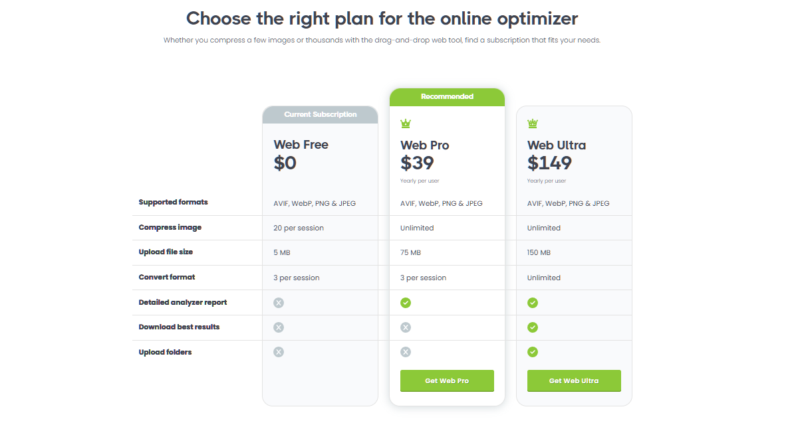

# 计划  「2025下」
<BlogHead date="2025-6-4"/>

---

这两天整理了一下工作情况和后续的打算，记录一下后半年的计划🗓

> tips：计划赶不上变化，后续有改动也是正常啦😁

 

#### 整体目标

- 压缩图片小工具
- 持续输出博客
- 维护 [`xfeng-admin`](https://github.com/wxfengg/xfeng-admin)
- 重学JavaScript高级
- 深入了解Vue源码
- **努力工作，好好生活**😊

 

#### 压缩图片小工具

为什么想要做这个东西呢？🤔

原因很简单，因为今天无意发现**TinyPng**这个狗东西竟然要收费了😡，气煞我也，虽然也有同类的网站，但我发现有的也已经需要看广告才能压缩，这类网站的发展最终都是要收费💰，所以干脆自己搞个小工具，以后不求人

~~目前这个已经在进行中，很快就可以完成✅~~，到时候也会把工具分享出去（菜鸡勿喷🙏），后面如果自己有什么奇思妙想，搞点有趣实用的东西🤔会放在博客的一个栏目里面。

**已上线**🎉🎉 [`ImageCompressionTool`](https://github.com/wxfengg/ImageCompressionTool)

~~后面计划用electron打包成一个桌面的exe文件，完成后会同步上传~~
**已上线**🎉🎉 [`ImageCompressionTool`](https://github.com/wxfengg/ImageCompressionTool) 下载ImageCompressionTool.zip文件，解压后直接打开ImageCompressionTool.exe即可使用

 

#### 博客

博客是长期输出，想到什么就写什么吧✍️

记录一下📝，可以是碎碎念，也可以是记事本👀

不管写什么，让自己坚持下去✊

 

#### xfeng-admin

[`xfeng-admin`](https://github.com/wxfengg/xfeng-admin)是我自己封装的一套中后台管理系统架子，也是借鉴了许多网上优秀的框架和开源项目。本意是在工作需要新开项目，所以打算搞一套初始模板可以套用。

开源社区已经有很多优秀的中后台管理，但鉴于我的水平有限力😅，对于那些知名的开源项目的代码，看得我头晕眼花...实在忍受不了过渡封装的我，打算自己搞一套**比较好看、容易上手且代码比较简单**的架子，于是[`xfeng-admin`](https://github.com/wxfengg/xfeng-admin)诞生了。

项目目前已经开源到GitHub了，如果有大佬看了觉得还不错，麻烦给个免费的start⭐️

后续的计划是继续维护，可能不会加什么新功能，因为本意就是做的简单，后续更多的是优化存在的问题，优化交互，优化界面和拓展性。这也算是为我的开源目标走出第一步😄

 

#### 重学JS高级、深入了解Vue源码

工作这么久以来，也没有仔仔细细认认真真总结和反思过自己

经过这些日子的思考🤔 觉得自己基础可能还是不够牢固，所以重学JS高级还是很有必要的

后面也计划深入了解Vue的源码，所以提前打好基础为后面做准备

 

#### 努力工作，好好生活

~~没想好怎么写~~ 其实是困了，明天补上🌚

6月份要搬家😮‍💨

所以这个月可能不会很频繁更新了，换一个地方，也是一个全新的开始。

兼顾生活和工作，不能让工作影响生活，生活也需要工作来维持。把自己的事情做好，然后再寻求成长，减少不必要的时间浪费

计划今年年底去旅游，暂定云南~~

其实每年都希望诗和远方，但都心有余力不足😅

加油，下半年~