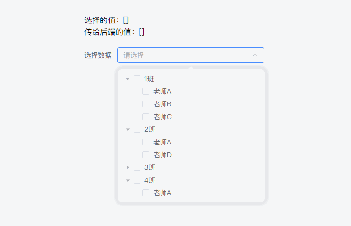
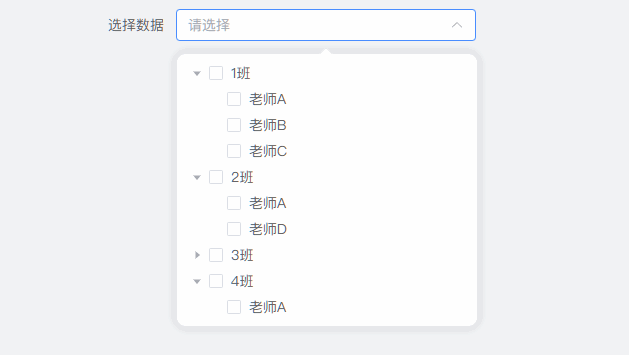
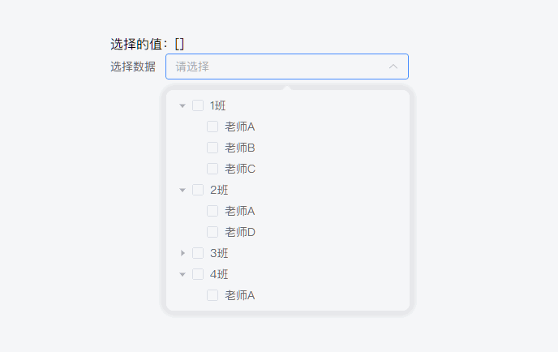
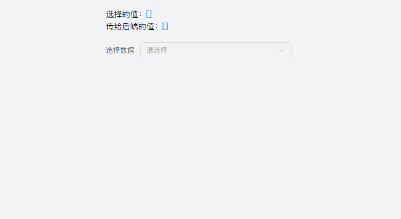

# TreeSelect树形选择在不同父节点下子节点有相同id的双向绑定联动

<BlogHead date="2025-10-27" tags="记录📝"/>

## 前言

有一个类似的开发需求：我需要通过一个树形数据选择老师，树形结构是每个父节点按班级分组，每个班级下班有老师，但是同一个老师可能教学多个班级，老师的id是唯一的，我需要在任意一个班级里勾选了某一个老师，其他班级只有存在该老师就给他也勾选上。

## 效果



## 思路

想要实现这个需求其实并不难，难的是还要做交互的联动，比如勾选了一个老师，虽然树形选择在表现上是勾选了多个，但是在输入框中你必须表现出只有一个老师，并且最后你传给后端可能也只是需要每个老师的id即可。

按照需求，我们先模拟一下树形结构后端返回的数据：

~~~ts
<script lang="ts" setup>
const treeData = [
  {
    label: "1班",
    value: "1",
    children: [
      {
        label: "老师A",
        value: "a",
      },
      {
        label: "老师B",
        value: "b",
      },
      {
        label: "老师C",
        value: "c",
      },
    ],
  },
  {
    label: "2班",
    value: "2",
    children: [
      {
        label: "老师A",
        value: "a",
      },
      {
        label: "老师D",
        value: "d",
      },
    ],
  },
  {
    label: "3班",
    value: "3",
    children: [
      {
        label: "老师B",
        value: "b",
      },
      {
        label: "老师E",
        value: "e",
      },
      {
        label: "老师F",
        value: "f",
      },
    ],
  },
  {
    label: "4班",
    value: "4",
    children: [
      {
        label: "老师A",
        value: "a",
      },
    ],
  },
]

const formData = ref({
  treeValue: [] as string[],
})
</script>

<template>
  <div class="size-full flex-center">
    <el-form :model="formData">
      <div>选择的值：{{ formData.treeValue }}</div>

      <el-form-item label="选择数据">
        <el-tree-select
          ref="treeRef"
          v-model="formData.treeValue"
          :data="treeData"
          node-key="value"
          multiple
          clearable
          show-checkbox
          style="width: 300px">
        </el-tree-select>
      </el-form-item>
    </el-form>
  </div>
</template>
~~~

我们知道，一般一棵树要求每个子节点都是唯一的，但如果我们直接使用这里的数据，那么看看交互会出现什么问题，没错，就是数据选择对不上了，有些选择框并没有选上。



因此，我们不能直接使用后端返回的数据，我们需要处理一下，要保证一棵树每个子节点都是唯一的。所以第一步我们需要处理一下树形结构的数据。我们把每个树的value改成父节点的value拼接子节点的value，那这样就可以做到每个子节点唯一，并且我们可以加一个id字段重新标识一下每个子节点的原始value。

~~~ts
<script lang="ts" setup>
const treeData = ... // 此处省略，参考上面数据即可

interface NodeType {
  label: string
  value: string
  id?: string
  children?: NodeType[]
}

const newTreeData = computed<NodeType[]>(() => {
  return treeData.map((item) => ({
    ...item,
    children: item.children.map((child) => ({
      ...child,
      value: `${item.value}-${child.value}`,
      id: child.value,
    })),
  }))
})

const formData = ref({
  treeValue: [] as string[],
})
</script>

<template>
  <div class="size-full flex-center">
    <el-form :model="formData">
      <div>选择的值：{{ formData.treeValue }}</div>

      <el-form-item label="选择数据">
        <el-tree-select
          ref="treeRef"
          v-model="formData.treeValue"
          :data="newTreeData"
          node-key="value"
          multiple
          clearable
          show-checkbox
          style="width: 300px">
        </el-tree-select>
      </el-form-item>
    </el-form>
  </div>
</template>
~~~

这时候我们可以看到，每个子节点已经是唯一了



但是我们希望的是选择了一个老师，其他班级下面有该老师也得选上，这时候我们需要用到`TreeSelect`组件的`check-change`和`setCheckedKey`方法了，这两个方法具体使用请参考[Element Plus官方文档](https://element-plus.org/zh-CN/component/tree#%E5%AF%B9%E5%A4%96%E6%9A%B4%E9%9C%B2%E7%9A%84%E6%96%B9%E6%B3%95)

实现的思路原理就是，当我选择A老师的时候，遍历树形数据，只有是id相同的老师，都给他手动勾选上，代码如下：

~~~ts
<script lang="ts" setup>
// 前面相关代码已省略，参考上面代码即可

const treeRef = ref<InstanceType<typeof ElTree> | null>()
const checkedValues = ref(new Set<string>()) //使用set数据结构，保证传给后端的老师id是唯一的
const change = async (node: NodeType, isChecck: boolean) => {
  if (node.children) return

  isChecck
    ? checkedValues.value.add(node.id as string)
    : checkedValues.value.delete(node.id as string)

  setCheckedKey(node.id as string, isChecck)
}

const setCheckedKey = async (id: string, isChecck: boolean) => {
  const allChildrenNodes = getAllChildrenNode(newTreeData.value)

  formData.value.treeValue = isChecck
    ? Array.from(
        new Set([
          ...formData.value.treeValue,
          ...allChildrenNodes
            .filter((item: any) => item.value.endsWith(`-${id}`))
            .map((item: any) => item.value),
        ])
      )
    : formData.value.treeValue.filter((item: any) => !item.includes(`${id}`))

  await nextTick()
  treeRef.value?.setCheckedKeys(formData.value.treeValue)
}

// 递归获取全部子节点的节点数据
const getAllChildrenNode = (data: any) => {
  return data.flatMap((item: any) => {
    if (item.children) return getAllChildrenNode(item.children)
    return item
  })
}
</script>

<template>
  <div class="size-full flex-center">
    <el-form :model="formData">
      <div>选择的值：{{ formData.treeValue }}</div>

      <el-form-item label="选择数据">
        <el-tree-select
          ref="treeRef"
          v-model="formData.treeValue"
          :data="newTreeData"
          node-key="value"
          multiple
          clearable
          show-checkbox
          style="width: 300px">
        </el-tree-select>
      </el-form-item>
    </el-form>
  </div>
</template>
~~~



可以看到效果基本实现了，最后只需要把输入框重复的问题解决一下即可，自己维护一个数组，用于在输入框中显示

~~~ts
<script lang="ts" setup>
const parkingLabels = ref<NodeType[]>([])
watch(
  () => checkedValues.value,
  (newVal) => {
    const allChildrenNodes = getAllChildrenNode(newTreeData.value)
    parkingLabels.value = allChildrenNodes.filter((item: any) =>
      Array.from(newVal).includes(item.value.split("-")[1])
    )
    parkingLabels.value = deduplication(parkingLabels.value, "id")
  },
  { deep: true }
)
// 根据对象的key去重
const deduplication = <T extends Record<string, any>>(
  arr: T[],
  key: keyof T
): T[] => {
  return Array.from(new Map(arr.map((item) => [item[key], item])).values())
}

const close = (id: string) => {
  checkedValues.value.delete(id)
  setCheckedKey(id, false)
}
</script>

<template>
  <div class="size-full flex-center">
    <el-form :model="formData">
      <div>选择的值：{{ formData.treeValue }}</div>
      <div class="mb-20px">传给后端的值：{{ Array.from(checkedValues) }}</div>

      <el-form-item label="选择数据">
        <el-tree-select
          ref="treeRef"
          v-model="formData.treeValue"
          :data="newTreeData"
          @check-change="change"
          node-key="value"
          multiple
          clearable
          show-checkbox
          style="width: 300px">
          <template #tag>
            <el-tag
              v-for="item in parkingLabels"
              type="info"
              closable
              @close="close(item.id as string)">
              {{ item.label }}
            </el-tag>
          </template>
        </el-tree-select>
      </el-form-item>
    </el-form>
  </div>
</template>
~~~

最后效果完美实现：


完整的demo代码：

```ts
<script lang="ts" setup>
interface NodeType {
  label: string
  value: string
  id?: string
  children?: NodeType[]
}
const treeData = [
  {
    label: "1班",
    value: "1",
    children: [
      {
        label: "老师A",
        value: "a",
      },
      {
        label: "老师B",
        value: "b",
      },
      {
        label: "老师C",
        value: "c",
      },
    ],
  },
  {
    label: "2班",
    value: "2",
    children: [
      {
        label: "老师A",
        value: "a",
      },
      {
        label: "老师D",
        value: "d",
      },
    ],
  },
  {
    label: "3班",
    value: "3",
    children: [
      {
        label: "老师B",
        value: "b",
      },
      {
        label: "老师E",
        value: "e",
      },
      {
        label: "老师F",
        value: "f",
      },
    ],
  },
  {
    label: "4班",
    value: "4",
    children: [
      {
        label: "老师A",
        value: "a",
      },
    ],
  },
]
const newTreeData = computed<NodeType[]>(() => {
  return treeData.map((item) => ({
    ...item,
    children: item.children.map((child) => ({
      ...child,
      value: `${item.value}-${child.value}`,
      id: child.value,
    })),
  }))
})

const formData = ref({
  treeValue: [] as string[],
})

const treeRef = ref<InstanceType<typeof ElTree> | null>()
const checkedValues = ref(new Set<string>())
const change = async (node: NodeType, isChecck: boolean) => {
  if (node.children) return

  isChecck
    ? checkedValues.value.add(node.id as string)
    : checkedValues.value.delete(node.id as string)

  setCheckedKey(node.id as string, isChecck)
}

const parkingLabels = ref<NodeType[]>([])
watch(
  () => checkedValues.value,
  (newVal) => {
    const allChildrenNodes = getAllChildrenNode(newTreeData.value)
    parkingLabels.value = allChildrenNodes.filter((item: any) =>
      Array.from(newVal).includes(item.value.split("-")[1])
    )
    parkingLabels.value = deduplication(parkingLabels.value, "id")
  },
  { deep: true }
)
const deduplication = <T extends Record<string, any>>(
  arr: T[],
  key: keyof T
): T[] => {
  return Array.from(new Map(arr.map((item) => [item[key], item])).values())
}

const setCheckedKey = async (id: string, isChecck: boolean) => {
  const allChildrenNodes = getAllChildrenNode(newTreeData.value)

  formData.value.treeValue = isChecck
    ? Array.from(
        new Set([
          ...formData.value.treeValue,
          ...allChildrenNodes
            .filter((item: any) => item.value.endsWith(`-${id}`))
            .map((item: any) => item.value),
        ])
      )
    : formData.value.treeValue.filter((item: any) => !item.includes(`${id}`))

  await nextTick()
  treeRef.value?.setCheckedKeys(formData.value.treeValue)
}

const getAllChildrenNode = (data: any) => {
  return data.flatMap((item: any) => {
    if (item.children) {
      return getAllChildrenNode(item.children)
    }
    return item
  })
}

const close = (id: string) => {
  checkedValues.value.delete(id)
  setCheckedKey(id, false)
}
</script>

<template>
  <div class="size-full flex-center">
    <el-form :model="formData">
      <div>选择的值：{{ formData.treeValue }}</div>
      <div class="mb-20px">传给后端的值：{{ Array.from(checkedValues) }}</div>

      <el-form-item label="选择数据">
        <el-tree-select
          ref="treeRef"
          v-model="formData.treeValue"
          :data="newTreeData"
          @check-change="change"
          node-key="value"
          multiple
          clearable
          show-checkbox
          style="width: 300px">
          <template #tag>
            <el-tag
              v-for="item in parkingLabels"
              type="info"
              closable
              @close="close(item.id as string)">
              {{ item.label }}
            </el-tag>
          </template>
        </el-tree-select>
      </el-form-item>
    </el-form>
  </div>
</template>

```
