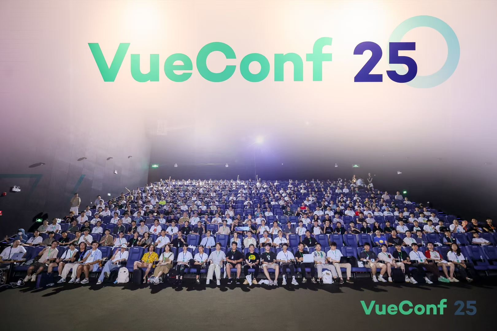
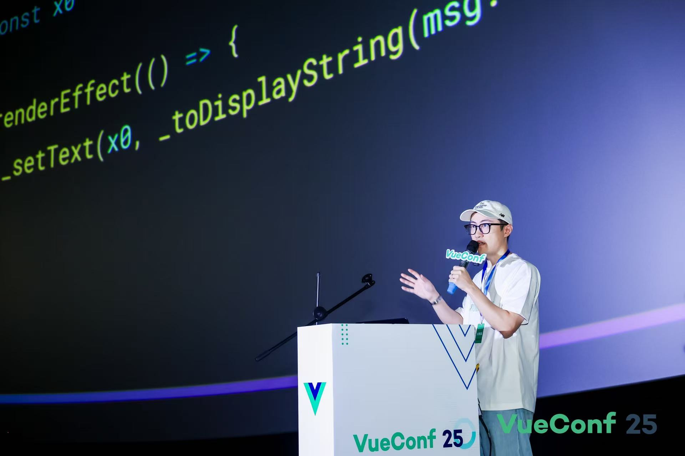
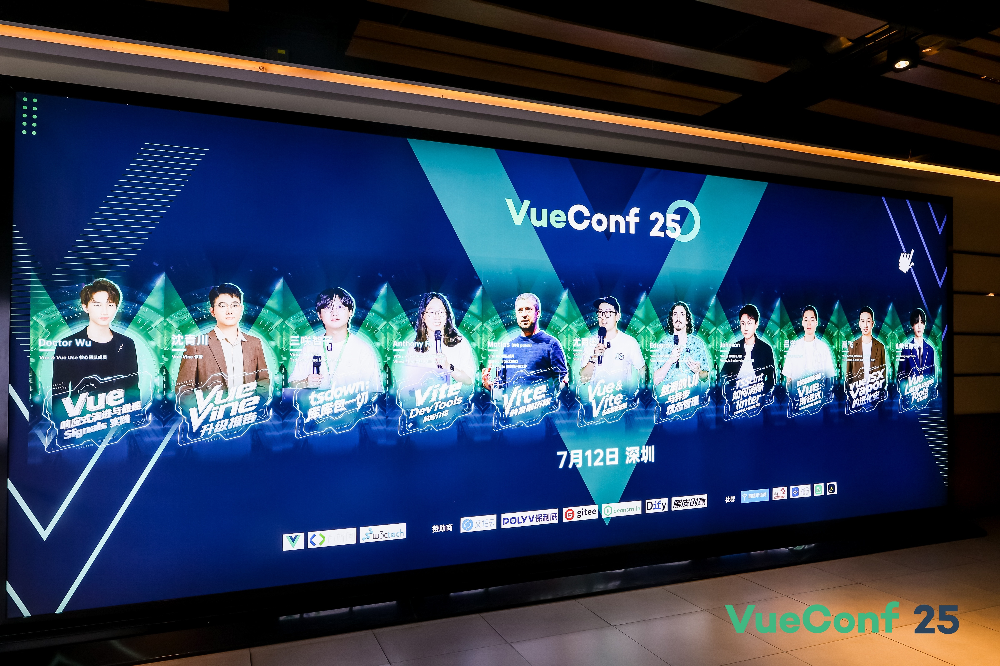
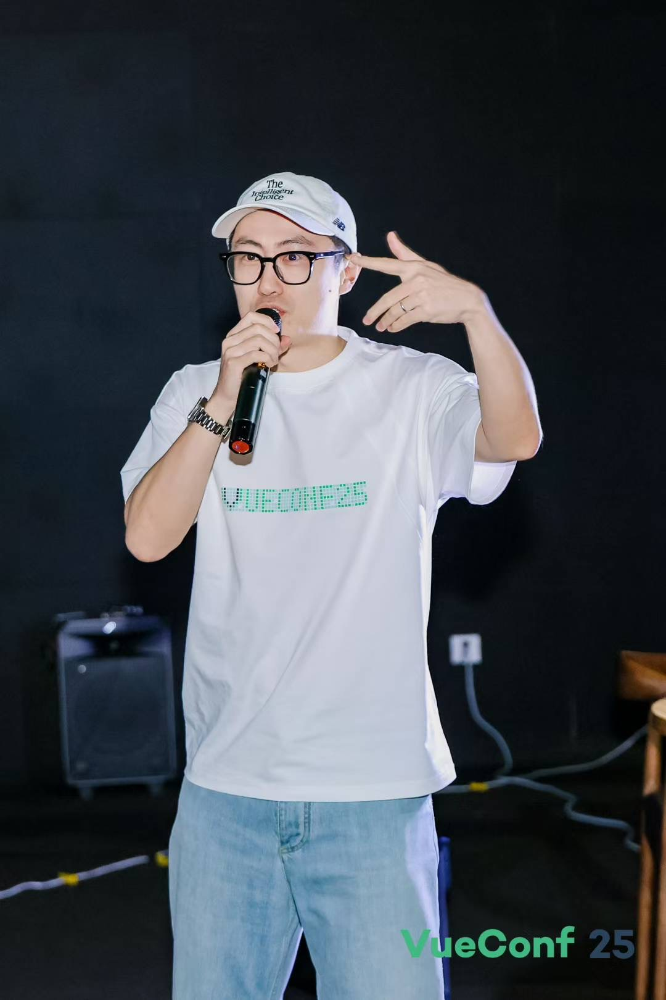

# VueConf2025🎉
<BlogHead date="2025-7-15" tags="碎碎念💬"/>

---
### 前言

一个月没更新博客了，承认是有点懒了😛

六月底刚搬完家，前前后后又忙了几天。七月份尝试在🐟接了一些单来做，刚开始反响不错，又忙活了两个星期~

好了，废话讲完，这次主要说说 **`VueConf2025`** 吧

 

### 开始

今年的 **`VueConf`** 在深圳举行，本来去年就想参加了（因为去年也在深圳），但是由于种种原因没去成。但是今年去了，其实为什么想去呢？原因主要有~~两点~~三点：

- 最主要的还是见偶像啦😄 嘿嘿，合上影了，也是得愿以偿了🥰
- 目前自己的工作和学习方向都是跟 **Vue** 相关
- 长长见识、开开眼界👀

### 正片

说实话，今年的 **`VueConf2025`** 的内容还是比较丰富的，也有新的东西，特别是东西都有一定的难度，当然这都是个人感觉，下面我说一下对这次大会的总结：

- 今年很多Vue Compiler的底层知识，很多时候听得我都犯困了😅
- 今年来的大佬很多，说的东西都比较新颖不少。
- **vapor**：干掉vDOM，性能赶上原生JS，渲染速度提升🚀300％+，内存降低60%+，主打一个返璞归真属于是。
- **vue vine**：这个我不怎么用，也不怎么了解，没认真听🙇‍♀️
- **vue-jsx**：更新挺大的，不过我也不怎么写jsx，所以只是简单听了一下，主要是实现了全部vue指令和vue的宏：defineComponet、defineSlot、defineExpose、defineStyle等。
- 还有智子的tsdown，和托尼老师（[Anthony Fu](https://antfu.me/)）的设计哲学。
- 最后，还有个最重磅的！！！ 就是 `v-rapper` 祖师爷的 “别墅里面唱k~” 太有节目效果了🤣

 

### 最后

大会参加了，技术也听了🤔，偶像看到了🤩，合影也合到了🎉

哈哈，参加这次 **VueConf** 是一次有趣的体验，让我学到了很多，也看到了很多不一样的风景。

文章的最后，我还是想说说会后我的一些感受和思考🤔

- **对于Vue**，我可能只是会用，但我并不了解它。所以对于大会讲的的内容，都是一知半解，很多底层的知识不够了解，也不熟悉，甚至是缺少这种意识，探索的意识。在程序员，在技术这条道理上，我仍有很长的路要走，很多窟窿要补。
- 今天目睹了很多大佬的真容，大部分大佬都是全职的开源工作者，对于他们来讲，需要耗费更多的精力去维护这些项目，需要花更多的时间。我觉得，要做到这种程度，最重要的就是 **热爱** 。因为热爱，才会有源源不断的动力。对于我自己来说也是如此，我要问清楚自己的内心，你到底要走什么样的路，自己是否足够热爱，是否有足够的精力去探索，要用心💗去思考，用实际行动付出成果。
- **学好英语很重要**。无论是现在新技术的探索，或是想要参与开源项目，还是走到更大的舞台，英语始终是绕不开的。无论是对一手资源的了解，还是看文档看issue都是英文的，换句话说，你要走出去，就得用英语。但是我认为：学英语并不需要你去学什么语法，英语只是一个工具，你只要常用的词汇量，能简单沟通就好，还有一个就是，不要忌讳英语，不要害怕它，你敢去用敢去看，多看其实也就自然而然就会了。🙂

 

好了，很久也没更新文章了，碎碎念也结束了，止笔至此，有新的感受再记录吧📝

后面继续努力吧💪 加油💗

